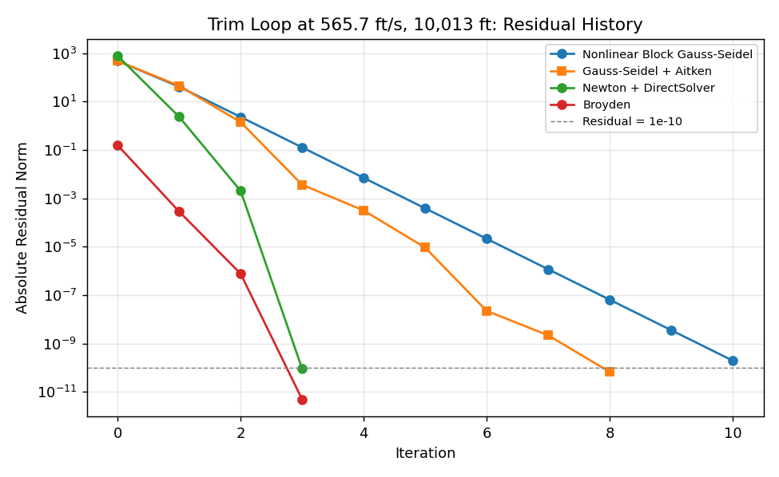

# Coupled trim loop in OpenMDAO: Gauss-Seidel (with and without Aitken), Newton and Broyden

OpenMDAO 3.45.1. Flight condition: V = 565.6854 ft/s, rho = 0.0017548326647844382 slug/ft^3, qbar = 280.773 psf, W = 20499.970 lbf, S = 300 ft^2. Aerodynamic coefficients from NASA's F-16 tables at VITAL's trim point (f16_coefficients.json, made by fit_f16_coefficients.m).

VITAL's own F-16 trim at this condition: alpha = 2.654226 deg, de = -3.241180 deg, T = 2366.165 lbf (throttle 13.9012 %).

Independent check (scipy fsolve on the two balance equations): alpha = 2.6542257816 deg, de = -3.2411803120 deg, T = 2366.164979 lbf.

Two formulations of the same physics. **Explicit**: component 5 computes alpha = (CL_req - CL0 - CLde de)/CLa (used by Gauss-Seidel and Newton). **Implicit**: component 5 holds alpha as a state with residual R = CL0 + CLa alpha + CLde de - CL_req (used by Broyden, which needs a state; Newton is repeated on it for comparison). Same stopping rule (residual below 1e-10, or 1e-12 of its starting value) and the same initial guess alpha = 0 for every run.

## NonlinearBlockGS (no Aitken)

| quantity | value |
|---|---|
| alpha | 2.6542257816 deg |
| elevator de | -3.2411803120 deg |
| thrust T | 2366.164979 lbf |
| CL | 0.2420743420 |
| Cm (should be 0) | 0.000e+00 |
| stopping rule | residual below 1e-10, or below 1e-12 x its start; at most 100 iterations |
| iterations | 12 |
| compute() calls (all components; implicit residual evaluations included) | 60 |
| compute_partials() / linearize() calls | 0 |
| agreement with independent fsolve | alpha 2.2e-15 deg, de 2.2e-14 deg, T 1.2e-11 lbf |
| difference from VITAL's F-16 trim | alpha -2.66e-15 deg, de +2.13e-14 deg, T -1.18e-11 lbf |

Calls per component: aero 12+0, alphacl 12+0, dragbal 12+0, liftreq 12+0, pitch 12+0 (compute + partials)

Residual history (absolute norm of the solver's residual per iteration):

| iter | abs residual | rel residual |
|---|---|---|
| 0 | 4.759e+02 | 5.620e-01 |
| 1 | 4.102e+01 | 4.844e-02 |
| 2 | 2.314e+00 | 2.733e-03 |
| 3 | 1.278e-01 | 1.509e-04 |
| 4 | 7.050e-03 | 8.325e-06 |
| 5 | 3.888e-04 | 4.592e-07 |
| 6 | 2.145e-05 | 2.533e-08 |
| 7 | 1.183e-06 | 1.397e-09 |
| 8 | 6.525e-08 | 7.706e-11 |
| 9 | 3.599e-09 | 4.251e-12 |
| 10 | 1.983e-10 | 2.341e-13 |

Reading the counts: 12 Gauss-Seidel sweeps, each running all 5 components once (60 compute calls). With use_apply_nonlinear off, OpenMDAO measures the NLBGS residual as the change in outputs between consecutive sweeps, so the first sweep has no residual and the table has one row fewer.

N2 diagram: `N2_trim_nlbgs.html`. Programmatic N2 checks:

- [PASS] all 9 expected connections present, nothing else (9 connections)
- [PASS] feedback: alpha from component 5 (alphacl) back to components 1-4 ([('trim.alphacl.alpha', 'trim.aero.alpha'), ('trim.alphacl.alpha', 'trim.dragbal.alpha'), ('trim.alphacl.alpha', 'trim.liftreq.alpha'), ('trim.alphacl.alpha', 'trim.pitch.alpha')])
- [PASS] N2 marks the connections that close a cycle (4 cycle-arrow connections)
- [PASS] trim group holds the 5 components in run order (['pitch', 'aero', 'dragbal', 'liftreq', 'alphacl'])
- [PASS] solver shown on the trim group (NL: NLBGS)
- [PASS] each component's inputs and outputs as designed ({"pitch": [["alpha", "input"], ["de", "output"]], "aero": [["CD", "output"], ["CL", "output"], ["Cm", "output"], ["alpha", "input"], ["de", "input"]], "dragbal": [["CD", "input"], ["T", "output"], ["alpha", "input"]], "liftreq": [["CL_req", "output"], ["T", "input"], ["alpha", "input"]], "alphacl": [["CL_req", "input"], ["alpha", "output"], ["de", "input"]]})
- [PASS] exactly one coupling cycle, containing all 5 components ([['aero', 'alphacl', 'dragbal', 'liftreq', 'pitch']])

## NonlinearBlockGS with Aitken acceleration

| quantity | value |
|---|---|
| alpha | 2.6542257816 deg |
| elevator de | -3.2411803120 deg |
| thrust T | 2366.164979 lbf |
| CL | 0.2420743420 |
| Cm (should be 0) | 0.000e+00 |
| stopping rule | residual below 1e-10, or below 1e-12 x its start; at most 100 iterations |
| iterations | 10 |
| compute() calls (all components; implicit residual evaluations included) | 50 |
| compute_partials() / linearize() calls | 0 |
| agreement with independent fsolve | alpha 0.0e+00 deg, de 0.0e+00 deg, T 4.5e-13 lbf |
| difference from VITAL's F-16 trim | alpha -4.44e-16 deg, de -8.88e-16 deg, T -4.55e-13 lbf |

Calls per component: aero 10+0, alphacl 10+0, dragbal 10+0, liftreq 10+0, pitch 10+0 (compute + partials)

Residual history (absolute norm of the solver's residual per iteration):

| iter | abs residual | rel residual |
|---|---|---|
| 0 | 4.759e+02 | 5.620e-01 |
| 1 | 4.489e+01 | 5.301e-02 |
| 2 | 1.416e+00 | 1.673e-03 |
| 3 | 3.660e-03 | 4.322e-06 |
| 4 | 3.175e-04 | 3.749e-07 |
| 5 | 9.280e-06 | 1.096e-08 |
| 6 | 2.249e-08 | 2.656e-11 |
| 7 | 2.198e-09 | 2.596e-12 |
| 8 | 6.776e-11 | 8.002e-14 |

Reading the counts: 10 Gauss-Seidel sweeps (50 compute calls), no derivatives. Aitken changes only how far each sweep's update is applied: the new coupling values are x_k + theta_k (x_GS - x_k), with theta_k from the last two residuals. When the plain iteration contracts by a steady factor r, the ideal relaxation is about 1/(1 - r), which removes most of the error a plain sweep leaves behind. It costs nothing extra: the same component calls per sweep plus a few vector operations.

N2 diagram: `N2_trim_nlbgs_aitken.html`. Programmatic N2 checks:

- [PASS] all 9 expected connections present, nothing else (9 connections)
- [PASS] feedback: alpha from component 5 (alphacl) back to components 1-4 ([('trim.alphacl.alpha', 'trim.aero.alpha'), ('trim.alphacl.alpha', 'trim.dragbal.alpha'), ('trim.alphacl.alpha', 'trim.liftreq.alpha'), ('trim.alphacl.alpha', 'trim.pitch.alpha')])
- [PASS] N2 marks the connections that close a cycle (4 cycle-arrow connections)
- [PASS] trim group holds the 5 components in run order (['pitch', 'aero', 'dragbal', 'liftreq', 'alphacl'])
- [PASS] solver shown on the trim group (NL: NLBGS)
- [PASS] each component's inputs and outputs as designed ({"pitch": [["alpha", "input"], ["de", "output"]], "aero": [["CD", "output"], ["CL", "output"], ["Cm", "output"], ["alpha", "input"], ["de", "input"]], "dragbal": [["CD", "input"], ["T", "output"], ["alpha", "input"]], "liftreq": [["CL_req", "output"], ["T", "input"], ["alpha", "input"]], "alphacl": [["CL_req", "input"], ["alpha", "output"], ["de", "input"]]})
- [PASS] exactly one coupling cycle, containing all 5 components ([['aero', 'alphacl', 'dragbal', 'liftreq', 'pitch']])

## NewtonSolver + DirectSolver

| quantity | value |
|---|---|
| alpha | 2.6542257816 deg |
| elevator de | -3.2411803120 deg |
| thrust T | 2366.164979 lbf |
| CL | 0.2420743420 |
| Cm (should be 0) | 0.000e+00 |
| stopping rule | residual below 1e-10, or below 1e-12 x its start; at most 20 iterations |
| iterations | 3 |
| compute() calls (all components; implicit residual evaluations included) | 20 |
| compute_partials() / linearize() calls | 9 |
| agreement with independent fsolve | alpha 2.2e-13 deg, de 1.2e-13 deg, T 2.9e-09 lbf |
| difference from VITAL's F-16 trim | alpha +2.24e-13 deg, de -1.21e-13 deg, T -2.89e-09 lbf |

Calls per component: aero 4+3, alphacl 4+0, dragbal 4+3, liftreq 4+3, pitch 4+0 (compute + partials)

Residual history (absolute norm of the solver's residual per iteration):

| iter | abs residual | rel residual |
|---|---|---|
| 0 | 7.715e+02 | 1.000e+00 |
| 1 | 2.344e+00 | 3.038e-03 |
| 2 | 2.037e-03 | 2.640e-06 |
| 3 | 9.095e-11 | 1.179e-13 |

Reading the counts: row 0 is the residual of the initial guess; rows 1 onward follow each Newton step. 4 model evaluations x 5 components = 20 compute calls. compute_partials ran 3 times in each of the 3 components with non-constant derivatives (pitch and alphacl declare constant partials once), and DirectSolver did one LU solve per Newton step.

N2 diagram: `N2_trim_newton.html`. Programmatic N2 checks:

- [PASS] all 9 expected connections present, nothing else (9 connections)
- [PASS] feedback: alpha from component 5 (alphacl) back to components 1-4 ([('trim.alphacl.alpha', 'trim.aero.alpha'), ('trim.alphacl.alpha', 'trim.dragbal.alpha'), ('trim.alphacl.alpha', 'trim.liftreq.alpha'), ('trim.alphacl.alpha', 'trim.pitch.alpha')])
- [PASS] N2 marks the connections that close a cycle (4 cycle-arrow connections)
- [PASS] trim group holds the 5 components in run order (['pitch', 'aero', 'dragbal', 'liftreq', 'alphacl'])
- [PASS] solver shown on the trim group (NL: Newton)
- [PASS] each component's inputs and outputs as designed ({"pitch": [["alpha", "input"], ["de", "output"]], "aero": [["CD", "output"], ["CL", "output"], ["Cm", "output"], ["alpha", "input"], ["de", "input"]], "dragbal": [["CD", "input"], ["T", "output"], ["alpha", "input"]], "liftreq": [["CL_req", "output"], ["T", "input"], ["alpha", "input"]], "alphacl": [["CL_req", "input"], ["alpha", "output"], ["de", "input"]]})
- [PASS] exactly one coupling cycle, containing all 5 components ([['aero', 'alphacl', 'dragbal', 'liftreq', 'pitch']])

## BroydenSolver + DirectSolver (implicit lift balance, state alpha)

| quantity | value |
|---|---|
| alpha | 2.6542257815 deg |
| elevator de | -3.2411803120 deg |
| thrust T | 2366.164979 lbf |
| CL | 0.2420743420 |
| Cm (should be 0) | 0.000e+00 |
| stopping rule | residual below 1e-10, or below 1e-12 x its start; at most 50 iterations |
| iterations | 3 |
| compute() calls (all components; implicit residual evaluations included) | 51 |
| compute_partials() / linearize() calls | 4 |
| agreement with independent fsolve | alpha 8.3e-11 deg, de 4.5e-11 deg, T 2.4e-08 lbf |
| difference from VITAL's F-16 trim | alpha -8.35e-11 deg, de +4.48e-11 deg, T -2.42e-08 lbf |

Calls per component: aero 11+1, dragbal 11+1, liftbal 7+1, liftreq 11+1, pitch 11+0 (compute + partials)

Residual history (absolute norm of the solver's residual per iteration):

| iter | abs residual | rel residual |
|---|---|---|
| 0 | 1.571e-01 | 1.000e+00 |
| 1 | 2.865e-04 | 1.824e-03 |
| 2 | 7.687e-07 | 4.894e-06 |
| 3 | 4.953e-12 | 3.153e-11 |

Reading the counts: Broyden iterates on ONE state, alpha (the residual of the implicit lift balance). Each iteration takes a quasi-Newton step on alpha, then re-runs the explicit components to refresh de, CD, T and CL_req, which is why compute calls (51) exceed 5 x iterations. Exact derivatives were computed only for the first Jacobian (4 compute_partials/linearize calls); every later step uses a rank-1 (secant) update. With one state this is the secant method, order about 1.6.

N2 diagram: `N2_trim_broyden.html`. Programmatic N2 checks:

- [PASS] all 9 expected connections present, nothing else (9 connections)
- [PASS] feedback: alpha from component 5 (liftbal) back to components 1-4 ([('trim.liftbal.alpha', 'trim.aero.alpha'), ('trim.liftbal.alpha', 'trim.dragbal.alpha'), ('trim.liftbal.alpha', 'trim.liftreq.alpha'), ('trim.liftbal.alpha', 'trim.pitch.alpha')])
- [PASS] N2 marks the connections that close a cycle (4 cycle-arrow connections)
- [PASS] trim group holds the 5 components in run order (['pitch', 'aero', 'dragbal', 'liftreq', 'liftbal'])
- [PASS] solver shown on the trim group (NL: BROYDEN)
- [PASS] component 5 is implicit (alpha is a state) (component/implicit)
- [PASS] each component's inputs and outputs as designed ({"pitch": [["alpha", "input"], ["de", "output"]], "aero": [["CD", "output"], ["CL", "output"], ["Cm", "output"], ["alpha", "input"], ["de", "input"]], "dragbal": [["CD", "input"], ["T", "output"], ["alpha", "input"]], "liftreq": [["CL_req", "output"], ["T", "input"], ["alpha", "input"]], "liftbal": [["CL_req", "input"], ["alpha", "output"], ["de", "input"]]})
- [PASS] exactly one coupling cycle, containing all 5 components ([['aero', 'dragbal', 'liftbal', 'liftreq', 'pitch']])

## NewtonSolver + DirectSolver (implicit lift balance)  (comparison run)

| quantity | value |
|---|---|
| alpha | 2.6542257816 deg |
| elevator de | -3.2411803120 deg |
| thrust T | 2366.164979 lbf |
| CL | 0.2420743420 |
| Cm (should be 0) | 0.000e+00 |
| stopping rule | residual below 1e-10, or below 1e-12 x its start; at most 20 iterations |
| iterations | 3 |
| compute() calls (all components; implicit residual evaluations included) | 20 |
| compute_partials() / linearize() calls | 12 |
| agreement with independent fsolve | alpha 2.2e-13 deg, de 1.2e-13 deg, T 2.9e-09 lbf |
| difference from VITAL's F-16 trim | alpha +2.24e-13 deg, de -1.21e-13 deg, T -2.89e-09 lbf |

Calls per component: aero 4+3, dragbal 4+3, liftbal 4+3, liftreq 4+3, pitch 4+0 (compute + partials)

Residual history (absolute norm of the solver's residual per iteration):

| iter | abs residual | rel residual |
|---|---|---|
| 0 | 7.715e+02 | 1.000e+00 |
| 1 | 2.344e+00 | 3.038e-03 |
| 2 | 2.037e-03 | 2.640e-06 |
| 3 | 9.095e-11 | 1.179e-13 |

Same Newton + DirectSolver on the implicit formulation: the residual history matches the explicit run, as it should, because both formulations define the same root.

## BroydenSolver + DirectSolver (full-model mode, explicit loop)  (comparison run)

| quantity | value |
|---|---|
| alpha | 2.6542257816 deg |
| elevator de | -3.2411803120 deg |
| thrust T | 2366.164979 lbf |
| CL | 0.2420743420 |
| Cm (should be 0) | 0.000e+00 |
| stopping rule | residual below 1e-10, or below 1e-12 x its start; at most 50 iterations |
| iterations | 8 |
| compute() calls (all components; implicit residual evaluations included) | 130 |
| compute_partials() / linearize() calls | 6 |
| agreement with independent fsolve | alpha 3.6e-14 deg, de 3.4e-13 deg, T 1.8e-10 lbf |
| difference from VITAL's F-16 trim | alpha -3.60e-14 deg, de +3.39e-13 deg, T -1.83e-10 lbf |

Calls per component: aero 26+2, alphacl 26+0, dragbal 26+2, liftreq 26+2, pitch 26+0 (compute + partials)

Residual history (absolute norm of the solver's residual per iteration):

| iter | abs residual | rel residual |
|---|---|---|
| 0 | 1.768e+00 | 1.000e+00 |
| 1 | 1.789e+00 | 1.012e+00 |
| 2 | 2.746e+06 | 1.553e+06 |
| 3 | 3.731e+04 | 2.110e+04 |
| 4 | 1.300e+02 | 7.353e+01 |
| 5 | 2.995e-02 | 1.694e-02 |
| 6 | 9.129e-04 | 5.163e-04 |
| 7 | 1.869e-07 | 1.057e-07 |
| 8 | 1.365e-12 | 7.719e-13 |

Comparison, not recommended: Broyden in full-model mode (no state_vars) on the all-explicit loop. It converges, but only after the residual grows to about 1e7 and two extra exact Jacobians are computed (6 compute_partials calls in all). Each Broyden iteration also re-runs the explicit components, which overwrite the outputs Broyden just updated, so the rank-1 secant updates see changes the step did not make. OpenMDAO's Broyden is meant for implicit states; the implicit lift-balance run is the correct use.

Analytic partial derivatives vs complex step (force_alloc_complex=True), both formulations: worst relative error 1.9e-16.

## Comparison with VITAL's F-16 trim

| | SciComp (all four solvers) | VITAL | largest difference |
|---|---|---|---|
| alpha | 2.654226 deg | 2.654226 deg | 8.3e-11 deg |
| elevator | -3.241180 deg | -3.241180 deg | 4.5e-11 deg |
| thrust | 2366.165 lbf | 2366.165 lbf | 2.4e-08 lbf |

PASS: within 1e-3 deg and 1 lbf of VITAL. Expected, because the coefficients are NASA's slopes at exactly this trim point. Away from this speed and altitude the straight-line model drifts from the F-16 (not tested here: single flight condition). Thrust here is thrust REQUIRED; VITAL also gives the throttle setting from NASA's engine tables.

## Comparison

| approach | iterations | compute calls | derivative calls | convergence |
|---|---|---|---|---|
| Gauss-Seidel | 12 | 60 | 0 | linear, factor 0.055 per iteration |
| Gauss-Seidel + Aitken | 10 | 50 | 0 | linear with adaptive relaxation; see history |
| Newton | 3 | 20 | 9 | quadratic |
| Broyden (state alpha) | 3 | 51 | 4 | superlinear (secant) |

- **Gauss-Seidel** needs no derivatives and is cheapest per iteration. It converges at a fixed rate set by the loop gain (how strongly alpha feeds back through the elevator and thrust); it would slow as the gain nears 1 and diverge above it.
- **Aitken acceleration** keeps Gauss-Seidel's zero derivative cost and cut the iterations from 12 to 10 here. It works best when the plain iteration contracts at a steady rate, as here; it can also rescue a Gauss-Seidel loop whose gain is near or above 1, which plain Gauss-Seidel cannot converge.
- **Newton** uses an exact Jacobian every iteration (derivatives + one linear solve), so each iteration costs most, but it converges quadratically: the number of correct digits roughly doubles per step.
- **Broyden** gets most of Newton's speed with almost none of its derivative cost: one exact Jacobian, then cheap rank-1 updates. Its catch, shown by the comparison run, is that in OpenMDAO it must iterate on implicit states; pointed at explicit outputs it fights the components that recompute them.
- **All runs give the same trim**, agreeing with the independent fsolve to round-off (Broyden to its tolerance).
- **Residuals are not on one scale.** Newton reports the norm of the whole group residual; Broyden only the residual of its state (the lift balance, in CL units); Gauss-Seidel the change in outputs between sweeps. Each met the same atol/rtol on its own measure, so compare iteration counts and convergence shape, not raw magnitudes.

**Overall: ALL CHECKS PASS**