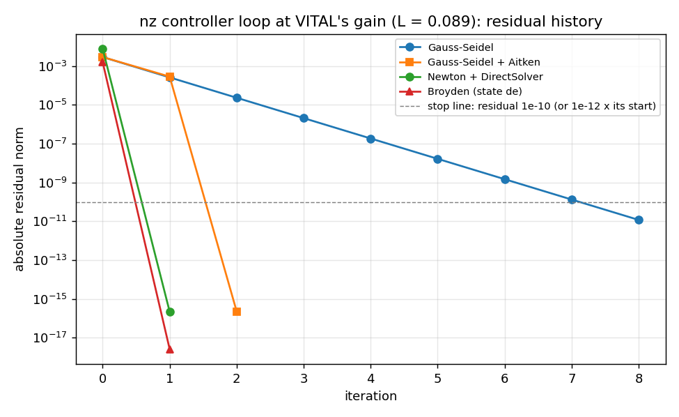
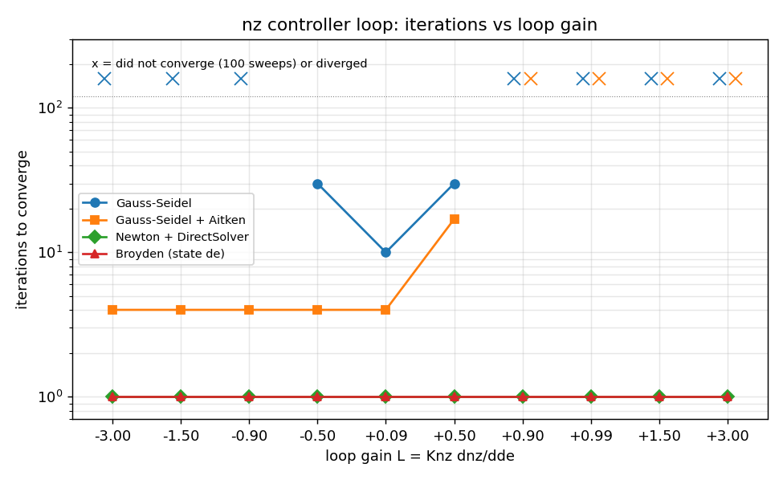

# VITAL's nz controller loop in OpenMDAO: Gauss-Seidel (with and without Aitken), Newton and Broyden

OpenMDAO 3.45.1. F-16 frozen at VITAL's trim point (565.6854 ft/s, 10,013 ft, CG 25 % MAC; trim elevator -3.241180 deg, nz0 = 0.99892719 g). Numbers from nz_loop_data.json, made by fit_nz_loop.m.

The loop (VITAL ADR-026; the fixture of tests/M5/tClosedLoopR1.m):

```
de_ref --> [3 ctrl: de = de_ref + Knz (nz - nz0)] --de--> [1 aero: CZ] --CZ--> [2 nzsens: nz] --+
                ^                                                                             |
                +------------------------------- nz ------------------------------------------+
```

Plant: CZ = CZ0 + CZde (de - de0), CZ0 = -0.24311410, CZde = -0.435448/rad; nz = -(qbar S/W) CZ, qbar S/W = 4.108882. So dnz/dde = 1.789204 g/rad. Controller gain Knz = 0.05 rad/g. **Loop gain L = Knz dnz/dde = 0.089460.**

Test input: a +1 deg elevator command, de_ref = -2.241180 deg. Exact answer (the loop is linear): de - de0 = 1 deg / (1 - L) = 1.0982496448 deg. Every solver starts from de = de_ref, as VITAL does. Same solver settings and stopping rule as trim_mda.py.

## Gauss-Seidel

| quantity | value |
|---|---|
| applied elevator de | -2.1429306672 deg |
| step through the loop, de - de0 | 1.0982496448 deg |
| load factor nz | 1.0332227859 g |
| iterations | 10 |
| compute() calls (implicit residual evaluations included) | 30 |
| compute_partials() / linearize() calls | 0 |
| error vs exact answer | 3.2e-12 deg |

Residual history:

| iter | abs residual | rel residual |
|---|---|---|
| 0 | 2.879e-03 | 8.946e-02 |
| 1 | 2.575e-04 | 8.003e-03 |
| 2 | 2.304e-05 | 7.160e-04 |
| 3 | 2.061e-06 | 6.405e-05 |
| 4 | 1.844e-07 | 5.730e-06 |
| 5 | 1.649e-08 | 5.126e-07 |
| 6 | 1.476e-09 | 4.586e-08 |
| 7 | 1.320e-10 | 4.102e-09 |
| 8 | 1.181e-11 | 3.670e-10 |

Reading the counts: 10 sweeps x 3 components = 30 compute calls, no derivatives. The residual is the change in outputs between sweeps, so the first sweep has no row. It shrinks by L = 0.0895 per sweep: the error left after a sweep is L times the one before.

N2 diagram: `N2_nz_nlbgs.html`. Programmatic N2 checks:

- [PASS] all 4 expected connections present, nothing else (4 connections)
- [PASS] feedback: de from component 3 (ctrl) back to component 1 (aero) ([('loop.ctrl.de', 'loop.aero.de')])
- [PASS] N2 marks the connections that close a cycle (1 cycle-arrow connections)
- [PASS] loop group holds the 3 components in run order (['aero', 'nzsens', 'ctrl'])
- [PASS] solver shown on the loop group (NL: NLBGS)
- [PASS] each component's inputs and outputs as designed ({"aero": [["CZ", "output"], ["de", "input"]], "nzsens": [["CZ", "input"], ["nz", "output"]], "ctrl": [["de", "output"], ["de_ref", "input"], ["nz", "input"]]})
- [PASS] exactly one coupling cycle, containing the 3 loop components (cmd outside it) ([['aero', 'ctrl', 'nzsens']])

## Gauss-Seidel + Aitken

| quantity | value |
|---|---|
| applied elevator de | -2.1429306672 deg |
| step through the loop, de - de0 | 1.0982496448 deg |
| load factor nz | 1.0332227859 g |
| iterations | 4 |
| compute() calls (implicit residual evaluations included) | 12 |
| compute_partials() / linearize() calls | 0 |
| error vs exact answer | 8.0e-16 deg |

Residual history:

| iter | abs residual | rel residual |
|---|---|---|
| 0 | 2.879e-03 | 8.946e-02 |
| 1 | 2.828e-04 | 8.789e-03 |
| 2 | 2.293e-16 | 7.126e-15 |

Reading the counts: 4 sweeps (12 compute calls), no derivatives. After two sweeps Aitken has measured the contraction L and stretches the update by 1/(1 - L); on a linear loop that lands on the answer.

N2 diagram: `N2_nz_nlbgs_aitken.html`. Programmatic N2 checks:

- [PASS] all 4 expected connections present, nothing else (4 connections)
- [PASS] feedback: de from component 3 (ctrl) back to component 1 (aero) ([('loop.ctrl.de', 'loop.aero.de')])
- [PASS] N2 marks the connections that close a cycle (1 cycle-arrow connections)
- [PASS] loop group holds the 3 components in run order (['aero', 'nzsens', 'ctrl'])
- [PASS] solver shown on the loop group (NL: NLBGS)
- [PASS] each component's inputs and outputs as designed ({"aero": [["CZ", "output"], ["de", "input"]], "nzsens": [["CZ", "input"], ["nz", "output"]], "ctrl": [["de", "output"], ["de_ref", "input"], ["nz", "input"]]})
- [PASS] exactly one coupling cycle, containing the 3 loop components (cmd outside it) ([['aero', 'ctrl', 'nzsens']])

## Newton + DirectSolver

| quantity | value |
|---|---|
| applied elevator de | -2.1429306672 deg |
| step through the loop, de - de0 | 1.0982496448 deg |
| load factor nz | 1.0332227859 g |
| iterations | 1 |
| compute() calls (implicit residual evaluations included) | 6 |
| compute_partials() / linearize() calls | 0 |
| error vs exact answer | 4.0e-16 deg |

Residual history:

| iter | abs residual | rel residual |
|---|---|---|
| 0 | 7.600e-03 | 1.000e+00 |
| 1 | 2.220e-16 | 2.922e-14 |

Reading the counts: one Newton step solves a linear loop exactly. compute_partials ran 0 times because every partial in this model is a constant declared once in setup(); DirectSolver did one LU solve.

N2 diagram: `N2_nz_newton.html`. Programmatic N2 checks:

- [PASS] all 4 expected connections present, nothing else (4 connections)
- [PASS] feedback: de from component 3 (ctrl) back to component 1 (aero) ([('loop.ctrl.de', 'loop.aero.de')])
- [PASS] N2 marks the connections that close a cycle (1 cycle-arrow connections)
- [PASS] loop group holds the 3 components in run order (['aero', 'nzsens', 'ctrl'])
- [PASS] solver shown on the loop group (NL: Newton)
- [PASS] each component's inputs and outputs as designed ({"aero": [["CZ", "output"], ["de", "input"]], "nzsens": [["CZ", "input"], ["nz", "output"]], "ctrl": [["de", "output"], ["de_ref", "input"], ["nz", "input"]]})
- [PASS] exactly one coupling cycle, containing the 3 loop components (cmd outside it) ([['aero', 'ctrl', 'nzsens']])

## Broyden (state de)

| quantity | value |
|---|---|
| applied elevator de | -2.1429306672 deg |
| step through the loop, de - de0 | 1.0982496448 deg |
| load factor nz | 1.0332227859 g |
| iterations | 1 |
| compute() calls (implicit residual evaluations included) | 13 |
| compute_partials() / linearize() calls | 1 |
| error vs exact answer | 8.0e-16 deg |

Residual history:

| iter | abs residual | rel residual |
|---|---|---|
| 0 | 1.561e-03 | 1.000e+00 |
| 1 | 2.602e-18 | 1.667e-15 |

Reading the counts: Broyden iterates on the ONE state de of the implicit controller. One exact Jacobian (1 linearize call) makes its first step a Newton step, which is exact here. The extra compute calls are the Gauss-Seidel sub-solves that refresh CZ and nz around each Broyden update.

N2 diagram: `N2_nz_broyden.html`. Programmatic N2 checks:

- [PASS] all 4 expected connections present, nothing else (4 connections)
- [PASS] feedback: de from component 3 (ctrlbal) back to component 1 (aero) ([('loop.ctrlbal.de', 'loop.aero.de')])
- [PASS] N2 marks the connections that close a cycle (1 cycle-arrow connections)
- [PASS] loop group holds the 3 components in run order (['aero', 'nzsens', 'ctrlbal'])
- [PASS] solver shown on the loop group (NL: BROYDEN)
- [PASS] component 3 is implicit (de is a state) (component/implicit)
- [PASS] each component's inputs and outputs as designed ({"aero": [["CZ", "output"], ["de", "input"]], "nzsens": [["CZ", "input"], ["nz", "output"]], "ctrlbal": [["de", "output"], ["de_ref", "input"], ["nz", "input"]]})
- [PASS] exactly one coupling cycle, containing the 3 loop components (cmd outside it) ([['aero', 'ctrlbal', 'nzsens']])

## What happens with no solver (OpenMDAO's default NonlinearRunOnce)

One pass: de = -2.1517201011 deg, step 1.089460 deg instead of 1.098250 deg (error 8.79e-03 deg, no warning). This is the pre-ADR-026 answer in VITAL too: the controller saw nz at the old command, so the loop was never closed. Leaving a cycle on RunOnce is the classic OpenMDAO mistake.

Hand-written partial derivatives vs complex step, both formulations: worst relative error 2.2e-16.

## Comparison with VITAL

| | SciComp (all four solvers) | VITAL | largest difference |
|---|---|---|---|
| closed-loop gain du/du_ref | 1.0982496448 | 1.0982496448 (vital.linear.linearize, Kref(de,de)) | 2.7e-12 |
| applied elevator for +1 deg | -2.1429306672 deg | -2.1429306672 deg (fzero on the full plant) | 2.6e-12 deg |
| load factor | 1.0332227859 g | 1.0332227859 g | 9.2e-13 g |

PASS: within 1e-8. VITAL's Kref is itself a finite-difference Jacobian of its Newton loop solve, so it agrees to about its step accuracy; the full-plant solve agrees to round-off because NASA's CZ is linear in the elevator.

## Loop-gain sweep (only Knz changes)

Iterations to the stopping rule; 'not conv.' = stopped at maxiter (100 Gauss-Seidel, 20 Newton, 50 Broyden) still shrinking the error (shown: start -> end), 'diverged' = error ended larger than the starting guess's.

| loop gain L | Knz (rad/g) | Gauss-Seidel | GS + Aitken | Newton | Broyden |
|---|---|---|---|---|---|
| -3.0000 | -1.6767 | diverged | 4 | 1 | 1 |
| -1.5000 | -0.8384 | diverged | 4 | 1 | 1 |
| -0.9000 | -0.5030 | not conv. (100), error 0.47 -> 1.3e-05 deg | 4 | 1 | 1 |
| -0.5000 | -0.2795 | 30 | 4 | 1 | 1 |
| +0.0895 | +0.0500 | 10 | 4 | 1 | 1 |
| +0.5000 | +0.2795 | 30 | 17 | 1 | 1 |
| +0.9000 | +0.5030 | not conv. (100), error 9 -> 0.00024 deg | not conv. (100), error 9 -> 8.8e-07 deg | 1 | 1 |
| +0.9900 | +0.5533 | not conv. (100), error 99 -> 36 deg | not conv. (100), error 99 -> 22 deg | 1 | 1 |
| +1.5000 | +0.8384 | diverged | diverged | 1 | 1 |
| +3.0000 | +1.6767 | diverged | diverged | 1 | 1 |

- [PASS] Gauss-Seidel shrinks the error exactly when |L| < 1 and diverges when |L| > 1, and reaches the stop line within 100 sweeps for |L| <= 0.5, as predicted: each sweep multiplies the error by L.
- [PASS] Newton and Broyden converge at every gain: the loop is linear, so the first exact Jacobian gives the answer in one step, whatever L is (except L = 1 exactly, where no solution exists).

- **Gauss-Seidel** contracts by |L| per sweep. At VITAL's gain (L = 0.09) that is fast; at L = 0.9 it needs about 230 sweeps for 1e-10; at L = 0.99 about 2,300; for |L| > 1 it diverges. Negative L (the sign of Knz flipped) makes it oscillate, same rule.
- **Aitken** measures the contraction and stretches the step by about 1/(1 - L). Its OpenMDAO limits (0.1 to 1.5) decide when that is allowed: for negative L the ideal factor 1/(1 - L) is below 1 and inside the limits, so Aitken converges in a few sweeps even where Gauss-Seidel diverges (L = -1.5, -3). For L near +1 the ideal factor is large (10 at L = 0.9) and is clipped to 1.5, so Aitken only speeds the slow contraction a little; above +1 the ideal factor is negative, no factor in [0.1, 1.5] contracts, and it diverges like plain Gauss-Seidel.
- **Newton / Broyden** cost derivatives but their iteration count does not depend on L. That is why VITAL closes this loop with Newton (ADR-028): it must work for any controller gain a user tries.





**Overall: ALL CHECKS PASS**