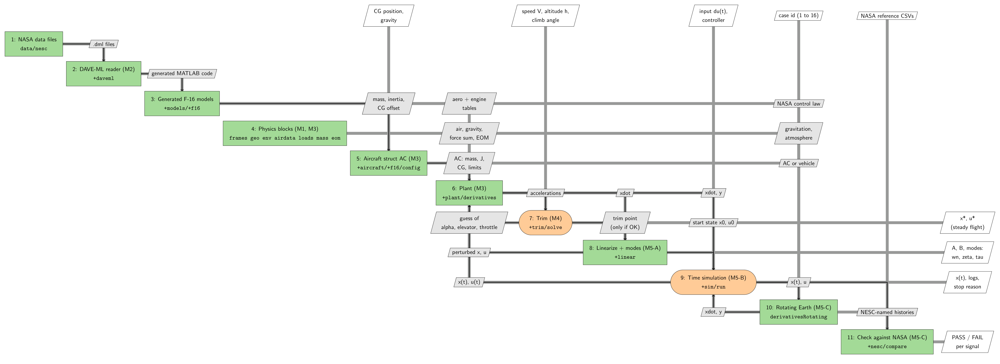
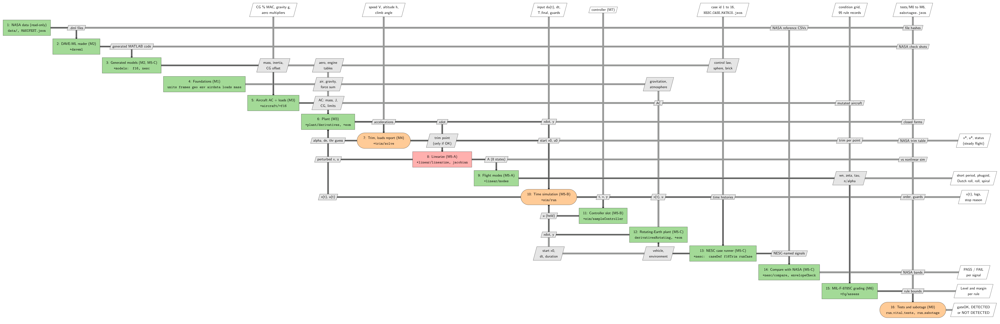
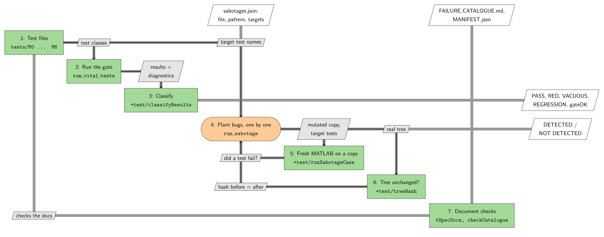
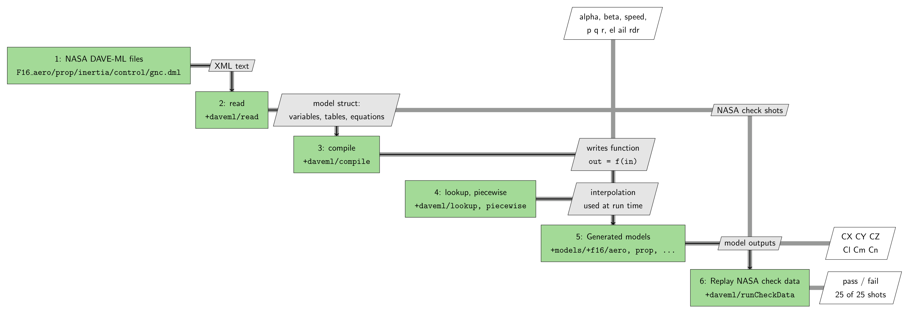
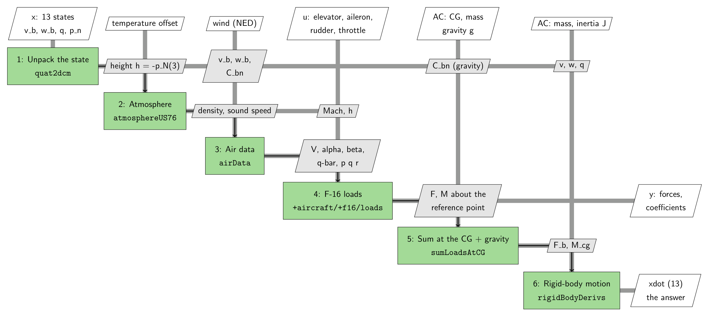
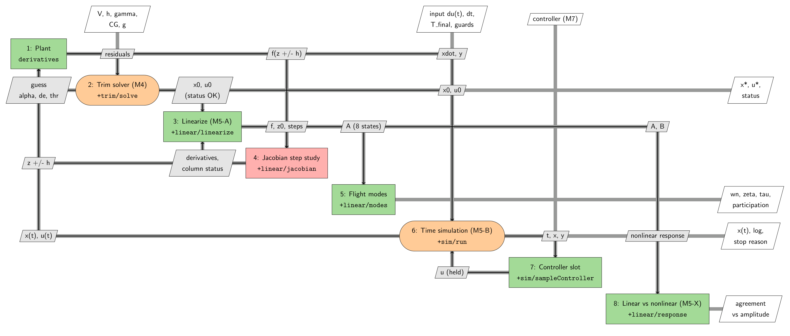
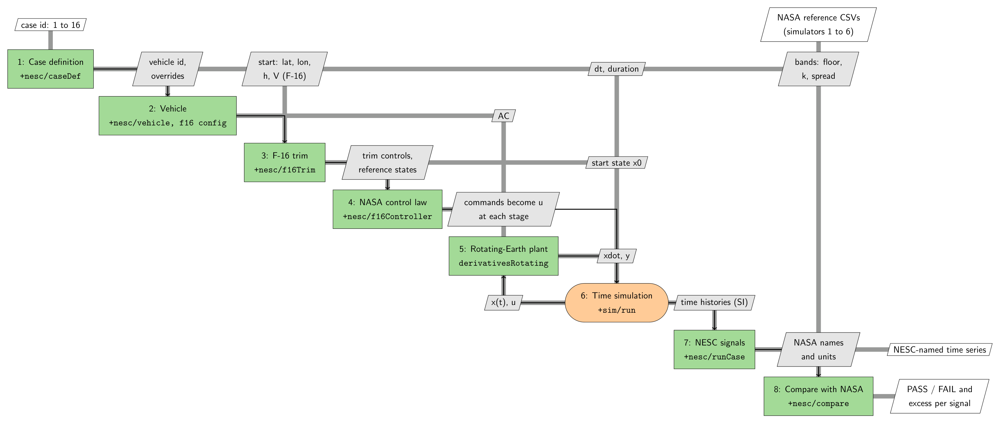

# VITAL framework guide, milestones M0 to M5

This guide explains what is in `C:\VITAL`, what every part does, and how the parts work together. You do not need to know anything about flight simulation to follow it. Read it top to bottom once; later use it as a reference.

The six diagrams in `docs/xdsm/` are referred to throughout. They are regenerated with `python docs/xdsm/vital_xdsm.py`.

---

## 1. What VITAL is, in plain words

VITAL (Virtual Test and Analysis Lab) is a computer model of one aircraft, the NASA/NESC F-16, together with the machinery to ask that model questions and to prove the answers are trustworthy.

An aircraft in flight obeys one rule: **forces and moments make it accelerate**. If you know the aircraft's state (where it is, how fast, which way it points, how fast it spins) and the pilot's controls (elevator, aileron, rudder, throttle), the air and gravity push on it, and Newton's laws tell you how the state changes in the next instant. VITAL computes that. Everything else is built on top of that one calculation.

From it, VITAL can answer four kinds of question:

| Question | Name | Answer you get |
|---|---|---|
| "What controls hold the aircraft in steady flight at this speed and altitude?" | **Trim** | angle of attack, elevator, throttle |
| "If I nudge the aircraft slightly, how does it respond?" | **Linearization and modes** | the aircraft's natural motions: frequency, damping, time constants |
| "What happens over the next 10 seconds if I move the stick?" | **Simulation** | time histories of everything |
| "Does my model agree with NASA's own simulators?" | **Check against NASA** | pass or fail for each signal |

The second half of VITAL is just as important as the first: **proof**. Every piece was written *after* tests that failed, then tested again, then attacked with deliberate bugs to prove the tests can notice mistakes. A number from VITAL is only believed if it has passed through that process.

### Why the building blocks are called "milestones" (M0, M1, ...)

The **M** stands for **milestone**. Each milestone is one layer. A layer is only allowed to rely on the layers below it, and only after every one of its tests passes and every deliberately planted bug is caught.

| Milestone | One-line meaning | Plain-language role |
|---|---|---|
| **M0** | Test machinery | the referee: runs tests and checks the tests themselves |
| **M1** | Foundations | the bricks: rotations, Earth, air, forces, mass |
| **M2** | NASA data import | reading NASA's F-16 files and turning them into MATLAB functions |
| **M3** | Plant | "given the state and controls, what is the acceleration?" |
| **M4** | Trim | finding steady flight; showing the forces and moments |
| **M5** | Dynamics | linearization, flight modes, time simulation, rotating-Earth check against NASA |
| M6 to M9 | later layers | flying-qualities grading, stability augmentation, uncertainty, Simulink and Cesium (not covered here) |

---

## 2. Words you will meet (glossary)

| Word | Meaning |
|---|---|
| **State, x** | everything needed to describe the aircraft right now: velocity, spin rates, attitude, position. VITAL's flat-Earth state has 13 numbers. |
| **Controls, u** | the four pilot inputs: elevator, aileron, rudder, throttle. |
| **xdot** | how fast each state number is changing (the "derivative"). The whole framework revolves around computing xdot from (x, u). |
| **Plant** | the function that does that: `xdot = f(x, u)`. Engineers call the thing being controlled "the plant". |
| **Body axes** | a coordinate system fixed to the aircraft: x out the nose, y out the right wing, z out the belly. |
| **NED** | North-East-Down: a coordinate system fixed to the ground below the aircraft. |
| **Angle of attack (alpha)** | the angle between the wing and the oncoming air, measured in the vertical plane. Sideslip (beta) is the sideways equivalent. |
| **Quaternion** | four numbers that describe the aircraft's attitude without the singularities of pitch, roll and yaw angles. VITAL integrates quaternions and converts to angles only for display. |
| **CG** | center of gravity. NASA's F-16 sits at 25% of the mean wing chord (25% MAC). |
| **MAC** | mean aerodynamic chord: a reference wing length (11.32 ft for this F-16). |
| **Trim** | a state where all accelerations are zero: steady flight. |
| **Residual** | how far a candidate trim is from zero acceleration. A good trim has residual about 1e-16. |
| **Linearization** | replacing the curved physics near a trim by straight-line physics: two matrices **A** (how states affect each other) and **B** (how controls affect states). |
| **Eigenvalue** | a number from matrix A that describes one natural motion: how fast it oscillates and how quickly it dies out or grows. |
| **Mode** | one natural motion of the aircraft. Five classic ones: **short period** (fast nose bobbing), **phugoid** (slow climb and dive exchange of speed and height), **Dutch roll** (yaw-roll wobble), **roll** (how fast the roll rate settles), **spiral** (slow drift in bank). |
| **Damping (zeta)** | how quickly an oscillation dies out. 0 = never, 1 = no oscillation at all. |
| **DAVE-ML** | an XML file format for aircraft models. NASA's F-16 aerodynamics, engine and mass are published in it. |
| **NESC** | NASA Engineering and Safety Center. Its check-case package (NASA/TM-2015-218675) gives exact flights that six independent simulators reproduced, so you can check your own simulator against them. |
| **MIL-F-8785C** | the U.S. military flying-qualities specification. VITAL grades aircraft against it in a later milestone. |
| **Test, gate** | a **test** checks one fact. A **gate** is the full list of tests up to a milestone; it passes only if every test passes. |
| **RED / GREEN** | RED = a new test that fails because the feature does not exist yet (expected, and proves the test can fail). GREEN = every test passes. |
| **Sabotage** | a deliberate bug planted in a *copy* of the code to prove that some test catches it. |
| **Evidence tag** | every numeric check says where its expected value comes from: **PUB** (a published value), **INDEP** (an independent implementation, for example MATLAB's Aerospace Toolbox), **ANALYTIC** (a closed-form answer worked out in the test), **REG** (a value registered before the run, not independently confirmed). |

---

## 3. Folder map

| Path | What it is |
|---|---|
| `C:\VITAL\` (root) | the nine user-facing scripts: `startup_vital.m`, `run_vital_tests.m`, `run_sabotage.m`, `run_f16_trim.m`, `run_f16_loads.m`, `run_f16_modes.m`, `run_f16_sim.m`, `run_nesc_case.m`, `run_f16_fq.m` (the last belongs to M6) |
| `+vital\` | the framework code. A folder starting with `+` is a MATLAB *package*: `+vital\+frames\dcm321.m` is called `vital.frames.dcm321`. |
| `tests\M0` ... `tests\M6` | the tests, one folder per milestone |
| `tests\fixtures\` | deliberately broken or synthetic files used only to test the test machinery itself |
| `docs\` | the specification documents (see section 11) |
| `docs\xdsm\` | the six diagrams and the script that draws them |
| `data\nesc\original`, `data\mil\original` | NASA's published package and the MIL standard PDF. Read-only; each file's SHA-256 hash is recorded in `data\MANIFEST.json` so tampering is detected. |
| `data\nesc\extracted\` | the same NASA package unzipped: the DAVE-ML models and the reference time histories |
| `rules\` | machine-readable rule records (used from M6) |
| `reports\` | every test and sabotage report, the changelog, and per-agent work folders |

---

## 4. The big picture: Figure 0

**How to read this and every XDSM figure.** Each box is a computation. The number in the box matches the numbered descriptions in this guide. Boxes sit on the diagonal. Grey lines carry data: a label tells you *what* travels along the line. A line leaving a box runs along its row; a line entering a box comes down its column. Lines below the diagonal that go back to an earlier box are **loops**: a solver guessing, calling the plant, and guessing again. Arrows entering from the top are inputs you supply; arrows leaving to the right are the results you receive. Green boxes are ordinary functions; orange rounded boxes are solvers that iterate.

**The story of Figure 0, in one pass:**

1. NASA's data files (box 1) are parsed (box 2) and written out as MATLAB functions (box 3): the F-16's aerodynamic tables, engine tables, mass and inertia, and NASA's control law.
2. The physics blocks (box 4) and the aircraft struct `AC` (box 5) are the other ingredients the plant (box 6) needs: air, gravity, mass, CG.
3. The plant (box 6) is the one calculation everything else uses: it turns (x, u) into xdot.
4. **Trim** (box 7) calls the plant over and over, adjusting three numbers until acceleration is zero.
5. **Linearize + modes** (box 8) starts from a trim, perturbs the plant slightly in 16 directions to build the A and B matrices, and finds the natural motions.
6. **Time simulation** (box 9) starts from a trim and steps the plant forward in time.
7. **Rotating Earth** (box 10) is a second plant, for NASA's check flights, which include the rotation of the Earth. The simulation (box 9) drives it too.
8. **Check against NASA** (box 11) compares the time histories with NASA's six simulators and says pass or fail for each signal.

### The full system on one page: Figure 6

This is the complete framework, M0 to M5 plus M6, in one diagram. It is wide (about 7,600 pixels); open `docs/xdsm/fig_6_full_system.pdf`, which is vector and zooms without blurring. Figure 0 is the simplified version; Figures 1 to 5 zoom into one part each.

| Box | What it is | Milestone | Files |
|---|---|---|---|
| 1 | NASA's published data, read-only and hash-checked | M0, M2 | `data\`, `MANIFEST.json` |
| 2 | reads NASA's XML and writes MATLAB code | M2 | `+daveml` |
| 3 | the generated F-16, sphere and brick models | M2, M5-C | `+models` |
| 4 | the physics bricks | M1 | `+units +frames +geo +env +airdata +loads +mass` |
| 5 | the aircraft struct AC and its force function | M3 | `+aircraft\+f16` |
| 6 | the plant: state and controls in, xdot out | M3 | `+plant\derivatives`, `+eom` |
| 7 | trim and the force breakdown | M4 | `+trim`, `trimLevel`, `loadsReport` |
| 8 | linear model A and B by step-study derivatives | M5-A | `+linear\linearize`, `jacobian` |
| 9 | flight modes | M5-A | `+linear\modes` |
| 10 | time simulation with guards | M5-B | `+sim\run` |
| 11 | the controller slot | M5-B | `+sim\sampleController` |
| 12 | the rotating-Earth plant | M5-C | `derivativesRotating`, `+eom` |
| 13 | runs one NASA case | M5-C | `+nesc` |
| 14 | compares with NASA's six simulators | M5-C | `+nesc\compare`, `envelopeCheck` |
| 15 | MIL-F-8785C grading | M6 (built, review pending) | `+fq` |
| 16 | runs the tests and plants the bugs | M0 | `run_vital_tests`, `run_sabotage` |

How to find the story in it:

- **The main chain** runs down the diagonal: NASA data (1) to the reader (2) to the models (3) to the aircraft (5) to the plant (6) to trim (7).
- **Every analysis loops with the plant.** Trim (7), linearize (8), simulate (10) and the rotating-Earth plant (12) each send a state to a plant and get xdot back. Those are the loops below the diagonal.
- **Box 16 is the referee.** Every box feeds one thing to it in the rightmost column: file hashes from box 1, NASA's check shots from box 2, closed forms from box 6, NASA's trim table from box 7, the linear-vs-nonlinear check from box 8, order and guards from box 10, NASA's bands from box 14, and rule bounds from box 15.
- **Results arrive on the right:** the trim, the five flight modes, the time histories, pass or fail per NASA signal, the Level per rule, and the gate verdict.

---

## 5. M0: the test machinery (the referee)

**What it is.** Before any physics, the project built the tools that decide whether physics code is trustworthy. M0 contains no flight physics at all.

**Files and what each does**

| File | What it is |
|---|---|
| `startup_vital.m` | adds VITAL to the MATLAB path and prints the version. |
| `run_vital_tests.m` | runs the gate for a milestone: every test tagged M0 up to Mk. Options let one increment be tested without being broken by another's unfinished work. It also **fails the gate if a test file silently fails to load**. |
| `run_sabotage.m` | the planted-bug check: for each registered sabotage, runs the targeted tests in a separate MATLAB process on a temporary copy of the code and requires them to fail. It also proves the real tree was not altered. |
| `+vital\version.m`, `paths.m` | the version string; the absolute folder locations. |
| `+vital\notImplemented.m` | what every unwritten function calls. It raises the one error `vital:notImplemented`, which marks a test as "RED for the right reason". |
| `+vital\+test\VitalTestCase.m` | the base class of every test. Its checks (`verifyTol`, `verifyWithin`, `verifyExact`) refuse NaN, refuse mixing absolute and relative tolerance, and record every check with its expected value, tolerance and evidence tag. |
| `+vital\+test\provenance.m` | the in-memory log of all those checks, written to JSON. |
| `+vital\+test\classifyResults.m` | sorts every result into PASS, RED-expected, RED-unexpected, RED-suspicious, VACUOUS (a new test that passes before its feature exists), or REGRESSION (an older test broke). It reads error *identifiers*, never message text. |
| `+vital\+test\selectMilestone.m`, `milestoneNumber.m` | choose the tests up to milestone k ("M1" never matches "M10"). |
| `+vital\+test\findExcludedTestFiles.m` | finds test files that matlab.unittest silently dropped. |
| `+vital\+test\loadSabotages.m`, `loadSabotageSet.m`, `applySabotage.m`, `runSabotageCase.m`, `runTargetsToFile.m`, `removeTree.m`, `treeHash.m` | the planted-bug machinery: load definitions, apply one to a copy, run its targets in a child MATLAB, and hash the real tree before and after. |
| `+vital\+io\validateRule.m`, `sampleRule.m` | the schema check for rule records (used from M6). |
| `+vital\+io\readFailureCatalogue.m`, `splitTestRef.m`, `checkCatalogue.m` | read `docs\FAILURE_CATALOGUE.md` and check each failure mode points at a real test. |
| `+vital\+io\sha256File.m`, `requireDeliverable.m` | file hashes for `MANIFEST.json`; a missing document counts as "not implemented". |

**Tests (50):** `tRunnerClassification` (the RED/GREEN logic), `tVitalTestCase`, `tSabotageHarness`, `tSpecDocs` (documents exist and agree), `tCatalogueRules`. Also tagged M1 but part of this machinery: `tRunnerIntegrity` (4) and `tRunnerIncrements` (9).

**How it combines (Figure 5).** Test files go into `run_vital_tests`, which hands the results to `classifyResults`; the output is PASS, RED, VACUOUS or REGRESSION and one yes/no `gateOK`. Separately, `run_sabotage` plants each registered bug in a copy, runs the targeted tests in a fresh MATLAB, and reports DETECTED or NOT DETECTED; `treeHash` proves your real files were never touched.

**What it feeds.** Every later milestone is built on this. M0 produces no number about an aircraft; it produces *trust* in the numbers that come later.

---

## 6. M1: the foundations (the bricks)

**What it is.** The small, general physics pieces every aircraft needs. None of them knows about the F-16. Each is checked against an independent implementation (usually MATLAB's Aerospace Toolbox) or a closed-form answer.

**Files and what each does**

| Package and file | What it does |
|---|---|
| `+units\constants` | exact conversion factors: feet to metres, slugs to kilograms, lbf to newtons. VITAL calculates in SI and converts only at the edges. |
| `+frames\dcm321` | the rotation matrix for yaw-pitch-roll angles (the "direction cosine matrix" taking NED axes to body axes). |
| `+frames\eul2quat`, `quat2dcm`, `dcm2quat`, `dcm2eul`, `quatNormalize` | convert between Euler angles, quaternions and rotation matrices; warn if a quaternion is not unit length; refuse a zero quaternion. |
| `+frames\stationToBody`, `inertiaStationToBody` | NASA publishes positions with x aft and z up; these convert them to VITAL's body axes (x forward, z down). |
| `+geo\constants` | the Earth model numbers from NASA's report (WGS-84 shape, gravity constant, J2, rotation rate). |
| `+geo\lla2ecef`, `ecef2lla` | latitude/longitude/height to Earth-centred Cartesian coordinates and back. |
| `+geo\dcmEcefToNed` | the rotation from Earth-centred axes to the local North-East-Down axes. |
| `+geo\gravitation`, `localGravitation` | gravity from Earth's mass including its flattening (the J2 term). |
| `+geo\levelFlightGravity` | the effective downward acceleration for steady level flight over a rotating Earth; includes Coriolis and curvature terms (built in M4). |
| `+env\atmosphereUS76`, `geometricToGeopotential` | the U.S. Standard Atmosphere 1976: temperature, pressure, density, speed of sound at any altitude. An altitude outside the model's range is an **error**, never a silent clamp. |
| `+airdata\airData` | from velocity and wind: true airspeed V, angle of attack, sideslip, dynamic pressure q-bar, Mach. |
| `+airdata\tasToCasEas`, `vaneAngles` | calibrated/equivalent airspeed; the angles a vane on a boom would sense. |
| `+loads\transferLoad`, `sumLoadsAtCG` | move a force and moment from one point to another; add everything up at the CG, with gravity. |
| `+mass\inertiaTensor`, `massProps` | build the 3x3 inertia matrix; combine several masses into one total mass, CG and inertia. Rejects physically impossible inertias. |
| `+validate\finite` | rejects NaN or Inf anywhere with the error `vital:badInput`. |
| `+verify\envelopeCheck` | the NASA comparison rule: VITAL passes if it lies within the range spanned by NASA's simulators, plus a pre-registered tolerance. |
| `+io\readNescCsv` | reads one of NASA's reference time histories. |

**Tests (93 in total with the machinery tests above):** `tFrames`, `tGeo`, `tLoads`, `tMass`, `tAtmosphere`, `tAirData`, `tEnvelopeCheck`, and `tM1FailureModes` (20 tests, each one asserting an exact error identifier for a bad input). Sabotages included a flipped cross-product in `transferLoad`, a swapped Euler order and geometric instead of geopotential altitude.

**How it combines.** Think of M1 as a toolbox. Nothing here produces an aircraft result by itself. The M3 plant (Figure 2) calls these functions in sequence: unpack the quaternion (`quat2dcm`), find density (`atmosphereUS76`), get air data (`airData`), sum the loads (`sumLoadsAtCG`).

**What it feeds.** M3 (the plant), M4 (trim gravity), M5-C (the rotating-Earth plant uses `geo`, `env`, `frames`).

---

## 7. M2: reading NASA's F-16 files

**What it is.** NASA's F-16 model is published as XML files full of tables and equations. M2 turns them into fast MATLAB functions and proves the conversion is exact.

**Files and what each does**

| File | What it does |
|---|---|
| `+daveml\read` | parses a DAVE-ML file into a MATLAB struct: variables, tables with their breakpoints, and the MathML equations. Refuses malformed files with specific errors (missing units, non-increasing breakpoints, unknown elements, truncated XML). |
| `+daveml\compile` | writes a self-contained MATLAB function `out = f(in)` for the whole model. |
| `+daveml\lookup`, `piecewise` | the run-time pieces the generated code calls: multilinear table interpolation (clamping outside the data, as NASA specifies) and the MathML "if-then-otherwise". |
| `+daveml\runCheckData` | replays NASA's own check cases embedded in the file and compares outputs to NASA's published values. |
| `+aircraft\+f16\generateModels` | the script that runs the above on NASA's five F-16 files. |
| `+models\+f16\aero`, `prop`, `inertia` | **generated, never edited**: the F-16 aerodynamic coefficients (CX, CY, CZ, Cl, Cm, Cn), the engine thrust, and the mass and inertia. |
| `+models\+f16\control`, `gnc` | generated later in M5-C: NASA's control law and its circumnavigation variant. |
| `+models\+nesc\brick_*`, `cannonball_*` | NASA's simple sphere and brick models, generated in M5-C. |

**Tests (29):** `tDavemlParser`, `tDavemlOperators` (every math operator against a hand-computed value), `tDavemlTables` (table storage order and clamping), `tF16CheckData`, `tDavemlFailures`. The headline test: **all 25 of NASA's embedded check points (16 aerodynamic, 9 engine) are reproduced to NASA's tolerances.**

**Two NASA quirks found along the way.** NASA wraps one `piecewise` in an operator-less `apply`, which a strict MathML reader rejects. NASA stores table data with the *last* breakpoint varying fastest, which is easy to reverse and still looks plausible. Both have tests.

**How it combines.** `read` produces a model struct; `compile` turns it into a function that calls `lookup`; `runCheckData` replays NASA's answers through that function and confirms they match.

**What it feeds.** M3: the F-16 plant calls `models.f16.aero` and `prop` for forces; the mass and CG come from `models.f16.inertia`. M5-C: `control` and `gnc` become the autopilot.

---

## 8. M3: the plant (the heart)

**What it is.** The single function that answers "given the state and controls, how is the state changing?" Trim, linearization and simulation all call it.

**Files and what each does**

| File | What it does |
|---|---|
| `+aircraft\+f16\config` | builds the aircraft struct **AC**: reference area, span, chord, mass, inertia, CG position, control limits, and the function that gives the aircraft's forces. Takes CG in % MAC. NASA gives aerodynamic moments about a point at 35% MAC; the CG is at 25%, so the reference points differ and `config` records both. |
| `+aircraft\+f16\loads` | converts SI to NASA's units (feet, degrees) **only at this boundary**, calls `models.f16.aero` and `prop`, and returns forces and moments about the geometry reference point. |
| `+eom\rigidBodyDerivs` | the flat-Earth rigid-body equations: acceleration = F/m minus the turning terms; angular acceleration from the inertia tensor; quaternion rate; position rate. |
| `+plant\derivatives` | the plant itself. Calls, in order: unpack the quaternion; atmosphere; air data; the aircraft's loads; sum at the CG with gravity; rigid-body equations. Returns `xdot` and a struct of diagnostics `y` (V, alpha, beta, Mach, forces, load factor, and whether any table lookup had to be clamped). |

**The numbers the plant takes and returns**

| Name | Contents |
|---|---|
| `x` (13) | body velocity (3), body rotation rates (3), attitude quaternion (4), NED position (3) |
| `u` (4) | elevator, aileron, rudder (rad), throttle (0 to 1) |
| `xdot` (13) | the rate of change of each state |
| `y` | alpha, beta, V, Mach, q-bar, h, forces, moments, load factor `nz`, `outOfEnvelope`, and more |

**Tests (19):** `tF16Plant` (control directions, unit conversion, moving the reference point must not change the answer, the CG moves the pitching moment the right way, bad inputs refused) and `tRigidBody` (torque-free spinning body conserves energy and angular momentum).

**How it combines (Figure 2).** The state is unpacked; the height gives the atmosphere; the atmosphere and velocity give air data; air data and controls give the F-16's forces; forces are moved to the CG and gravity is added; the rigid-body equations produce xdot.

**What it feeds.** M4 (trim), M5-A (linearization), M5-B (simulation).

---

## 9. M4: trim, and the force breakdown

**What it is.** Finding steady flight: the angle of attack, elevator and throttle at which nothing accelerates.

**Files and what each does**

| File | What it does |
|---|---|
| `+trim\solve` | adjusts three unknowns (alpha, elevator, throttle) until three residuals (u-dot, w-dot, q-dot) are zero, using `lsqnonlin` with several starting points. It refuses to call a result a trim unless it really is one: **OK**, **INFEASIBLE** (a variable sits on its limit, for example stall-limited at low speed), **NOT_CONVERGED**, **OUT_OF_DATA_ENVELOPE** (needed a clamped table), or **ERROR**. Only OK may be used. |
| `+aircraft\+f16\trimLevel` | the friendly wrapper: takes speed (ft/s), altitude (ft), CG, g and flight-path angle; returns pitch, alpha, elevator, throttle, Mach and thrust. |
| `+aircraft\+f16\loadsReport` | the force and moment breakdown: aero, thrust, gravity and total, in body axes; also lift, drag and side force. Can evaluate a state you choose, labelled "not a trim". |
| `+geo\levelFlightGravity` | the rotating-Earth correction that makes the flat-Earth trim match NASA's rotating-Earth value. |
| `run_f16_trim.m`, `run_f16_loads.m` | the commands you type. |

**Tests (26):** `tF16Trim` compares against NASA's published trim table (NASA README Table 11) and against NESC case 11; `tF16LoadsReport`; `tLevelFlightGravity`.

**Result.** At 565.7 ft/s and 10,013 ft: pitch 2.6542 degrees, elevator -3.2412 degrees, throttle 13.90%. NASA's published values are 2.6538, -3.2410 and 13.90%. At the trim every total force and moment is zero to about 1e-16.

**How it combines (Figure 3, top-left).** `trim.solve` guesses three numbers, the plant returns accelerations, `solve` adjusts the guess, and the loop repeats until the accelerations vanish.

**What it feeds.** M5: linearization and simulation both start from a trim, and both refuse any trim that is not OK.

---

## 10. M5: dynamics, simulation and the check against NASA

M5 has four parts, built and verified separately.

### 10.1 M5-A: linearization and flight modes

**What it is.** From a trim, build a straight-line model of how small disturbances behave, then read off the aircraft's natural motions.

| File | What it does |
|---|---|
| `+linear\jacobian` | the generic derivative calculator: central differences with a **step study** (it tries successively smaller steps and demands agreement). It **detects** table breakpoints, where the derivative jumps and a plain central difference would silently return the average; and detects rounding-limited cases. A column it cannot trust is reported, never guessed. |
| `+linear\linearize` | builds the 12x12 matrix **A** and 12x4 matrix **B** about a trim. Refuses a trim that is not OK, and refuses a trim that is not an equilibrium of the aircraft it is given (for example a 25%-CG trim with a 30%-CG aircraft). Also computes the MIL-F-8785C n/alpha, and can linearize with a controller in the loop. Reports a status for each of the 16 columns. |
| `+linear\eulerRates` | converts body rates to Euler-angle rates (3-2-1 convention). |
| `+linear\toPlantState`, `fromPlantState` | convert between the 12-state linear model and the 13-state plant. |
| `+linear\modes` | eigenvalues, then names each mode (short period, phugoid, Dutch roll, roll, spiral) using **participation factors** (how much each state takes part in each mode), which do not change with the choice of units. A short period that has split into two real roots is reported NOT_OSCILLATORY and given no frequency or damping. |
| `+linear\modeTable` | the modes as a printable table. |
| `+linear\nAlphaSteady` | the n/alpha defined by MIL-F-8785C: steady normal load factor per unit angle of attack, including the elevator's own lift. |
| `+linear\response` | the linear model's free response `expm(A t) dx0`. |
| `run_f16_modes.m` | the command you type: trims, linearizes, prints the mode table, and shows the phugoid with altitude coupling. |

**Result at the NASA trim:**

| Mode | Frequency | Damping | Time constant or period |
|---|---|---|---|
| Short period | 2.50 rad/s | 0.45 | period 2.8 s |
| Phugoid | 0.075 rad/s | 0.095 (0.078 with altitude) | period 84 s (78 s) |
| Dutch roll | 3.32 rad/s | 0.12 | period 1.9 s |
| Roll | n/a | n/a | time constant 0.34 s |
| Spiral | n/a | n/a | time constant 99 s (stable) |

These are regression values: no published F-16 eigenvalues exist to compare with. They agree with textbook approximations (short period 2-DOF, roll tau = -1/Lp, spiral -a0/a1) to within a few percent.

**Tests:** `tLinearJacobian`, `tJacobianR1`, `tF16Linearize`, `tLinearizeR1`, `tModes`, `tModesR1`, `tF16Modes`.

### 10.2 M5-B: time simulation

**What it is.** Step the plant forward in time with fixed-step fourth-order Runge-Kutta.

| File | What it does |
|---|---|
| `+sim\run` | the simulation driver. Takes the start state, an input history, an optional controller, and guards. Logs every step. **Guards** stop the run and record *why*, never by crashing: non-finite numbers (`vital:sim:nanState`), attitude norm drift (`quatNorm`), leaving the data envelope (`envelope`), hitting the ground (`ground`), a controller error, a plant error. It also flags any control command beyond its surface limit (`controlLimit`) without clipping it. |
| `+sim\rk4Step`, `rk4` | one RK4 step; a general RK4 integrator. Halving the step cuts the error 16 times, which the tests confirm. |
| `+sim\doublet`, `stepInput` | standard inputs: a doublet (a pulse each way) and a step. They must switch exactly on a step boundary. |
| `+sim\sampleController` | one sample of a discrete controller. The controller sees the plant measured under the command *actually being applied*, never one it has not yet sent (a decision recorded as ADR-026). Its output is held constant across the four RK4 stages. |
| `+sim\controlLimits` | the command limits the run monitors. |
| `run_f16_sim.m` | the command you type: trim, apply a doublet or step on any control, simulate, print a summary. |

**Result.** A 1 degree elevator doublet at the NASA trim moves alpha between 1.76 and 3.34 degrees, pitch rate between -3.0 and 3.4 degrees per second, and load factor between 0.70 and 1.20 g, while sideslip and roll stay exactly zero (the model is mirror-symmetric).

**Tests:** `tSimCore`, `tSimGuards`, `tF16Sim`, `tSimR1`.

### 10.3 M5-X: does the linear model agree with the simulation?

This cross-check ties M5-A to M5-B. A small disturbance is applied at the trim; the nonlinear simulation is run; the linear model predicts the same disturbance with `expm(A t)`.

| Check | Result |
|---|---|
| Agreement in short period, phugoid, roll/yaw | within 0.2%, 0.2%, 0.02% |
| Halving the disturbance | halves the error for longitudinal, quarters it for lateral (the expected second-order and third-order behaviour) |
| Frequency and damping read from the simulated response | agree with the linear modes to 0.12% |

One finding: the usual 8-state modal analysis gives a phugoid 7% too slow, because it ignores the air density and thrust changing with altitude. Including altitude as a ninth state fixes it.

Tests: `tLinearVsNonlinear`, `tClosedLoopLinearize`, `tClosedLoopR1`, `tClosedLoopSimAgreement`.

### 10.4 M5-C: NASA's recorded flights over a rotating Earth

**What it is.** The NESC package contains flights that six independent simulators reproduced: a dropped sphere, a tumbling brick, cannonballs, and the F-16 flying steady, and flying with NASA's autopilot. M5-C reproduces them in VITAL, including the rotation of the Earth, and compares signal by signal.

| File | What it does |
|---|---|
| `+plant\derivativesRotating` | a second plant, for a rotating (or fixed) round or WGS-84 Earth. Same signature as the first so the simulator drives either. State: Earth-centred position and velocity, attitude quaternion, and body rates relative to inertial space. |
| `+eom\rotatingRigidBody`, `rotatingState`, `rotatingToInertial`, `navRates` | the rotating-frame equations; building and converting the state; the angular rate of the local NED frame. |
| `+nesc\caseDef`, `caseIds` | each NASA case (1 to 16) as VITAL runs it, built from `docs\NESC_CASE_MATRIX.json`. |
| `+nesc\vehicle`, `bodyLoads` | the NASA sphere and brick: their loads. |
| `+nesc\f16Trim` | trims the F-16 for level flight over the rotating Earth, as NASA's starting condition. |
| `+nesc\f16Controller` | NASA's control law (`control` or `gnc`, generated in M2 style) as a VITAL controller: autopilot and stability augmentation. |
| `+nesc\equivalentAirspeed`, `crossTrack` | helpers the control law needs. |
| `+nesc\runCase` | runs a case through `sim.run` and returns the results under NASA's signal names and units. |
| `+nesc\reference` | NASA's reference histories for a case. |
| `+nesc\compare` | the pre-registered envelope comparison: each signal must stay within NASA's six simulators plus a tolerance set before any run. |
| `+nesc\stepStudy` | checks the time step is small enough that it is not what decides the result. |
| `run_nesc_case.m` | the command you type: run a case, print the comparison, optionally plot against NASA. |

**Where M5-C stands.**

| Cases | Result |
|---|---|
| 1 to 10 (spheres, bricks, cannonballs) | **all 25 of 25 signals inside the bands** in every case, on the first run, with no tuning |
| 11, 12 (F-16 steady flight) | 24 and 23 of 25 inside. The misses are tiny absolute values (the pitching moment misses by 0.0003 ft-lbf) but large against a very narrow band. |
| 13.1 to 13.4 (F-16 with the autopilot) | 19, 22, 15 and 11 of 25 inside |
| 15, 16 (F-16 circling the pole and the equator) | 15 and 18 of 25 inside |

In total 53 of the 200 F-16 band signals are outside their bands. They are **recorded as failed pre-registered expectations**, not hidden: each has a test that asserts the signal is still outside and no worse than measured, so any fix will show up. No band was changed after seeing results. The agent also disclosed that three of its own assumptions turned out wrong and were revised on documented evidence: the control law's execution rate, the frame its body rates are measured in, and the step sizes.

**Tests (60):** `tRotatingEom` (9), `tF16ControlLaw` (13), `tNescCases01to10` (18), `tNescF16Cases` (15), `tNescF16Circles` (5). All 14 planted bugs in this part are caught. The control-law limits were the last gap: an early test pushed each limit in one direction only, and missed the stick-total limit; a hand evaluator now checks all 22 limits in both directions.

---

## 11. The documents (`docs\`)

| File | Purpose |
|---|---|
| `CONVENTIONS.md` | the single most important document: units, frames, rotations, signs, trim status codes, error identifiers, evidence tags. Every function header refers to it. |
| `DECISIONS.md` | every design decision (ADR-001 to ADR-028 so far) with context, choice, consequences and tests. |
| `FAILURE_CATALOGUE.md` | every way VITAL can go wrong, how it is detected, the exact error or status, and the test that proves it. A closed milestone must have a real test for every row. |
| `VERIFICATION_MATRIX.md` | what evidence supports each capability. |
| `NESC_CASE_MATRIX.md/.json` | the 18 NASA cases with their pre-registered pass bands. |
| `MIL8785C_EXTRACT.md` | the transcribed flying-qualities requirements (used from M6). |
| `MILESTONES.json` | which milestones are closed (currently M0 to M5; M5 was closed on 2026-10-05 with the 53 F-16 NASA discrepancies accepted as documented). |
| `PLAN_M5_M8.md`, `AGENT_BRIEF.md` | the build plan and the rules the building agents followed. |
| `FRAMEWORK_GUIDE.md` | this file. |

---

## 12. Walk-through: what happens when you type a command

**`run_f16_trim`**
1. `config` builds the aircraft struct (mass, inertia, CG, limits).
2. `trim.solve` guesses alpha, elevator and throttle; each guess calls `plant.derivatives`.
3. The plant unpacks the state, gets atmosphere and air data, calls `aircraft.f16.loads` (which calls NASA's generated `aero` and `prop`), sums forces at the CG, and returns xdot.
4. The solver adjusts until u-dot, w-dot and q-dot are about zero, then reports a status. Only OK is printed as a trim.

**`run_f16_modes`**
1. Trim as above.
2. `linearize` calls `jacobian`, which calls the plant a few hundred times (16 columns, up to 7 step sizes each, two evaluations per step) at slightly different states, to build A and B.
3. `modes` finds the eigenvalues of A, names them using participation factors, and prints the table.

**`run_f16_sim`**
1. Trim as above gives the start state.
2. `sim.run` builds the input (a doublet, say), then at every 0.01 s takes one RK4 step: four calls to the plant per step.
3. After each step the guards check for NaN, ground contact, attitude drift or limits. A summary is printed.

**`run_nesc_case('11')`**
1. `caseDef` reads the case from the case matrix.
2. `f16Trim` trims over a rotating Earth; `f16Controller` builds NASA's control law.
3. `sim.run` runs the rotating-Earth plant for 180 s, with the law evaluated at every stage.
4. `runCase` renames and converts the results into NASA's signals; `compare` checks each against NASA's six simulators and prints PASS or FAIL.

---

## 12a. Visual axis checks

`run_axis_checks` draws 13 vector pictures of the frames and checks each against an independent answer. Run it to see that the axes behave as described in this guide. The PNGs are saved in `reportsxis_checks\`; each figure's title says PASS or FAIL, and the box beside it lists the numeric checks.

| Case | What you should see |
|---|---|
| yaw, pitch, roll | the nose swings toward East; the nose rises; the right wing drops |
| combined | the frames after yaw and after pitch, then the final 3-2-1 attitude |
| level, climb | the velocity arrow on the horizon; then climbing at 5 degrees |
| sideslip | the velocity toward the right wing and below the nose; a headwind adds airspeed |
| gravity | gravity in the aircraft's own axes, always toward the ground |
| cg | a side view: the MRC, the CG at 25 % and 30 %, and lift giving a nose-down moment |
| station | NASA station points turned into body axes |
| control | each +1 degree control gives a moment opposite its own axis |
| path | a simulated aileron step, with the aircraft rolling left along its path |
| earth | the local North-East-Down axes on the globe |

Four planted bugs (`tests\M5\sabotages_axis.json`) prove the pictures' checks would turn red if the axes were wrong.

## 13. How every number is verified

| Layer | Tests | Evidence |
|---|---|---|
| M0 test machinery | 50 (+13 runner tests tagged M1) | synthetic fixtures with known outcomes; planted bugs |
| M1 foundations | 80 | Aerospace Toolbox (INDEP), NASA atmosphere data (PUB), closed forms (ANALYTIC) |
| M2 NASA import | 29 | NASA's own check data (PUB): 25 of 25 shots; hand-computed operators |
| M3 plant | 19 | control signs; moving the reference point; conservation laws |
| M4 trim | 26 | NASA README Table 11 and NESC case 11 (PUB) |
| M5 dynamics | 171 | closed forms; the linear model against the simulation (INDEP); NASA's six simulators (PUB) |
| **Total (run 2026-10-05)** | **388** | |

After the code passes, deliberate bugs are planted in a copy of the code (the **sabotage check**). On 2026-10-05 all 96 planted bugs for M0 to M5 were caught on an unchanged tree (M0 5, M1 8, M2 5, M3 5, M4 7, M5 66).

Independent review agents, who did not write the code, then audited M5-A and M5-B. They found three real defects and 21 untested failure paths; all were fixed with new tests and re-verified.

---

## 14. How the milestones connect, in one table

| Milestone | Takes in | Produces | Used by |
|---|---|---|---|
| M0 | nothing | trustworthy pass/fail | all |
| M1 | numbers | rotations, Earth, air, load sums, mass | M3, M4, M5-C |
| M2 | NASA `.dml` files | F-16 aero, engine, mass, control law as MATLAB functions | M3, M5-C |
| M3 | state x, controls u, aircraft AC | xdot and diagnostics | M4, M5 |
| M4 | speed, altitude, CG | trim: alpha, elevator, throttle | M5 |
| M5-A | a trim | A, B, flight modes | M5-X, later M6 and M7 |
| M5-B | a trim, an input | time histories | M5-X, M5-C, later M7 |
| M5-C | NASA case, trim, control law | pass/fail against NASA | confidence in M3 to M5-B |

---

## 15. What is not here yet

- **M6** (built, review pending): MIL-F-8785C flying-qualities grading with Level and margin for each rule.
- **M7:** stability augmentation and design feedback.
- **M8:** uncertainty.
- **M9:** Simulink, Cesium and joystick. The older AAMF project has a working Simulink-to-Cesium chain, but it has its own flight equations; VITAL's tested plant will replace them.

Honest limits of what is built: the F-16 is validated only to the extent NASA's six simulators agree with VITAL; this shows VITAL implements NASA's published model the way NASA's tools do, not that it matches flight-test data. The mode values at the NASA trim are regression values with no published reference.
